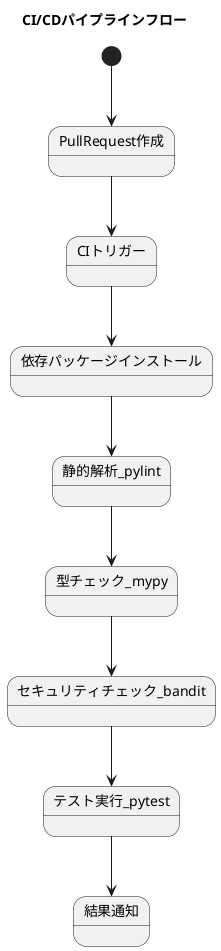

# テスト用リポジトリ

このリポジトリはCIワークフローのテストを記録するものです。
検討はGitHub Copilotを使っています。

---
## 目次

- [テスト用リポジトリ](#テスト用リポジトリ)
  - [目次](#目次)
  - [CI/CDパイプライン](#cicdパイプライン)
    - [ツールの選定](#ツールの選定)
      - [ディレクトリ・ファイル構成](#ディレクトリファイル構成)
      - [requirements.txt](#requirementstxt)
      - [GitHub Actionsワークフロー例（.github/workflows/ci.yml）](#github-actionsワークフロー例githubworkflowsciyml)
  - [CI/CDパイプライン図解](#cicdパイプライン図解)
- [ブランチ戦略](#ブランチ戦略)
    - [代表的なブランチ戦略](#代表的なブランチ戦略)
    - [軽量リポジトリの運用](#軽量リポジトリの運用)
  - [これまでの構築・運用過程まとめ](#これまでの構築運用過程まとめ)
  - [FAQ（よくある質問）](#faqよくある質問)
    - [Q1. pylintで「importエラー」が出る](#q1-pylintでimportエラーが出る)
    - [Q2. テストコードで未使用importや関数内importの警告が出る](#q2-テストコードで未使用importや関数内importの警告が出る)
    - [Q3. CIが動かない・失敗する](#q3-ciが動かない失敗する)
    - [Q4. ブランチ名の付け方にルールはある？](#q4-ブランチ名の付け方にルールはある)
---
## CI/CDパイプライン

業務利用を前提とするため、できるだけ厳密かつ、可能な限り軽量なパイプラインを作成する

### ツールの選定

- 静的解析はpylintを使用する
  - コーディング規約（PEP8）＋バグ検出＋設計品質（循環的複雑度など）まで幅広くカバー
  - デフォルトで多くのチェックが有効
  - カスタマイズ性が高い（無効化・独自ルール追加も可能）
レポート出力が詳細
- 型アノテーションチェックはmypyを使用する
  - 型アノテーション（PEP484）に基づく型チェック
  - 型安全性を担保できる
  - flake8/pylintと併用されることが多い
- テストはpytestを使用する

---
#### ディレクトリ・ファイル構成

```
test_repository/
├── .github/
│   └── workflows/
│       └── ci.yml      # ← GitHub Actionsのワークフロー定義
├── src/                # ← Pythonコード（例）
│   ├── __init__.py
│   └── main.py
├── tests/              # ← テストコード
│   ├── __init__.py
│   └── test_main.py
├── requirements.txt    # ← 依存パッケージ
├── README.md
├── .pylintrc

```

---
#### requirements.txt
```
pylint>=3.3.8
mypy>=1.17.1
bandit>=1.8.6
pytest>=8.4.1
```

---
#### GitHub Actionsワークフロー例（.github/workflows/ci.yml）

```yaml
name: Python CI

on:
  pull_request:
    branches: [ main ]

jobs:
  build:
    runs-on: ubuntu-latest

    steps:
    - uses: actions/checkout@v4  # リポジトリのソースコードを取得

    - name: Set up Python  # Python 3.11をセットアップ
      uses: actions/setup-python@v5
      with:
        python-version: '3.11'

    - name: Install dependencies  # 依存パッケージをインストール
      run: |
        python -m pip install --upgrade pip
        pip install -r requirements.txt

    - name: Lint with pylint  # コードの静的解析
      run: PYTHONPATH=. pylint src tests

    - name: Type check with mypy  # 型チェック
      run: PYTHONPATH=. mypy src

    - name: Security check with bandit  # セキュリティチェック
      run: bandit -r src

    - name: Run tests  # テスト実行
      run: PYTHONPATH=. pytest tests
```

---
## CI/CDパイプライン図解



---
# ブランチ戦略

### 代表的なブランチ戦略

1. GitHub Flow
   - **main（またはmaster）**ブランチのみを常にデプロイ可能な状態に保つ
   - 機能追加や修正はfeatureブランチ（mainから分岐）で作業し、PRでmainにマージ
   - リリースやhotfix専用ブランチは作らない
   - 小規模・高速リリース・CI/CD前提の現場で多い

2. Trunk Based Development
   - **main（trunk）**ブランチに全員が頻繁にマージ
   - 長期間のfeatureブランチは作らず、できるだけ小さな単位でmainに統合
   - フィーチャーフラグ等で未完成機能を隠すことも
   - スタートアップやアジャイル開発、DevOps現場で人気

3. Release Flow（GitHub Release Flowなど）
   - main（またはmaster）＋リリースごとにreleaseブランチを作成
   - 本本番リリース時のみreleaseブランチを切り、バグ修正やhotfixもreleaseブランチで管理
   - mainは常に最新・安定


### 軽量リポジトリの運用

GitHub Flowの場合、基本は「main（またはmaster）」＋「作業用ブランチ」のみで、作業用ブランチ名は「何の作業か」が分かるように付けるのが一般的です。

GitHub Flowのブランチ名の例
-  main（またはmaster）：本番用・常にデプロイ可能な状態
- feature/xxx：新機能追加（例: feature/login-page）
- fix/xxx：バグ修正（例: fix/login-error）
- hotfix/xxx：緊急修正（例: hotfix/critical-bug）
- chore/xxx：雑多な作業（例: chore/update-deps）
- docs/xxx：ドキュメント修正（例: docs/readme-update）

命名のポイント
- プレフィックス（feature, fix, chore, docsなど）＋内容
- スラッシュ区切りが主流（例: feature/xxx）
- 英語・小文字・ハイフン区切りが一般的
- チケット番号や課題番号を含めてもOK（例: fix/1234-login-error）

---
## これまでの構築・運用過程まとめ

1. PythonプロジェクトのCI/CDパイプラインをGitHub Actionsで構築。
2. 静的解析はpylint、型チェックはmypy、セキュリティチェックはbandit、テストはpytestを採用。
3. ディレクトリ構成・requirements.txt・ci.yml・サンプルソース・テストコードを整備。
4. PR作成時に自動でCIが動作することを確認。
5. pylintのimportエラー対策としてsrc/testsに__init__.pyを追加、PYTHONPATH=.で実行。
6. テストコードの未使用importや関数内importの警告（C0415, W0611）に対応。
7. .pylintrcを作成し、import-outside-toplevel警告を無効化。
8. ブランチ戦略はGitHub Flowを採用し、main＋feature/xxx等のシンプルな運用とした。

---
## FAQ（よくある質問）

### Q1. pylintで「importエラー」が出る
A. `src/`や`tests/`に`__init__.py`を追加し、`PYTHONPATH=.`を指定して実行してください。

### Q2. テストコードで未使用importや関数内importの警告が出る
A. `.pylintrc`で`import-outside-toplevel`警告を無効化できます。  
また、`# pylint: disable=unused-import`などのコメントで個別に無効化も可能です。

### Q3. CIが動かない・失敗する
A. 
- `requirements.txt`の内容が最新か確認してください。
- YAMLのインデントミスや、ファイルパスの誤りがないか確認してください。

### Q4. ブランチ名の付け方にルールはある？
A. 「feature/xxx」「fix/xxx」など、作業内容が分かる命名を推奨します。詳細は[ブランチ戦略](#ブランチ戦略)を参照してください。

---

このREADMEはGitHub Copilotの支援で作成・更新しています。
