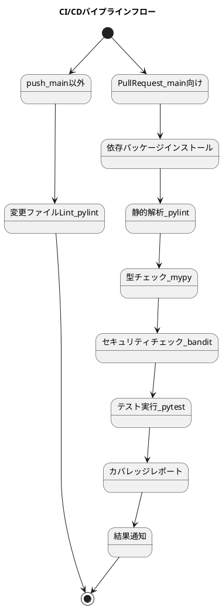

# テスト用リポジトリ

[](https://github.com/masaki-kato-119/test_repository/actions/workflows/ci.yaml)
[](https://codecov.io/gh/masaki-kato-119/test_repository)

このリポジトリはCIワークフローのテストを記録するものです。
検討はGitHub Copilotを使っています。

---
## 目次

- [テスト用リポジトリ](#テスト用リポジトリ)
  - [目次](#目次)
  - [CI/CDパイプライン](#cicdパイプライン)
  - [バッジについて](#バッジについて)
    - [ツールの選定](#ツールの選定)
      - [ディレクトリ・ファイル構成](#ディレクトリファイル構成)
      - [requirements.txt](#requirementstxt)
      - [GitHub Actionsワークフロー例（.github/workflows/ci.yaml）](#github-actionsワークフロー例githubworkflowsciyaml)
  - [CI/CDパイプライン図解](#cicdパイプライン図解)
- [ブランチ戦略](#ブランチ戦略)
    - [代表的なブランチ戦略](#代表的なブランチ戦略)
    - [軽量リポジトリの運用](#軽量リポジトリの運用)
  - [これまでの構築・運用過程まとめ](#これまでの構築運用過程まとめ)
  - [FAQ（よくある質問）](#faqよくある質問)
    - [Q1. pylintで「importエラー」が出る](#q1-pylintでimportエラーが出る)
    - [Q2. テストコードで未使用importや関数内importの警告が出る](#q2-テストコードで未使用importや関数内importの警告が出る)
    - [Q3. CIが動かない・失敗する](#q3-ciが動かない失敗する)
    - [Q4. ブランチ名の付け方にルールはある？](#q4-ブランチ名の付け方にルールはある)
---
## CI/CDパイプライン

業務利用を前提とするため、できるだけ厳密かつ、可能な限り軽量なパイプラインを作成する

本リポジトリのCI/CDパイプラインは2段階構成です。
- **push時（main以外）**: 変更のあったPythonファイルのみをpylintでLintし、素早いフィードバックを得ます。
 **Pull Request時（main向け）**: コード全体に対してpylint, mypy, bandit, pytest（カバレッジ付き）を実行し、mainブランチの品質を担保します。

## バッジについて

-   
  GitHub ActionsによるCI（継続的インテグレーション）の実行結果を示します。  
  mainブランチやPull RequestでCIが成功しているか一目で分かります。

- 
  テストカバレッジ（テストがどれだけコードを網羅しているか）を示します。  
  Codecov等の外部サービスと連携することで自動表示されます。

### ツールの選定

- 静的解析はpylintを使用する
  - コーディング規約（PEP8）＋バグ検出＋設計品質（循環的複雑度など）まで幅広くカバー
  - デフォルトで多くのチェックが有効
  - カスタマイズ性が高い（無効化・独自ルール追加も可能）
レポート出力が詳細
- 型アノテーションチェックはmypyを使用する
  - 型アノテーション（PEP484）に基づく型チェック
  - 型安全性を担保できる
  - flake8/pylintと併用されることが多い
- テストはpytestを使用する

---
#### ディレクトリ・ファイル構成

```
test_repository/
├── .github/
│   └── workflows/
│       └── ci.yaml      # ← GitHub Actionsのワークフロー定義
├── src/                # ← Pythonコード（例）
│   ├── __init__.py
│   └── main.py
├── tests/              # ← テストコード
│   ├── __init__.py
│   └── test_main.py
├── requirements.txt    # ← 依存パッケージ
├── README.md
├── .pylintrc

```

---
#### requirements.txt
```
pylint>=3.3.8
mypy>=1.17.1
bandit>=1.8.6
pytest>=8.4.1
```

---
#### GitHub Actionsワークフロー例（.github/workflows/ci.yaml）

```yaml
# GitHub Actionsワークフローの名前
name: Python CI/CD

# ワークフローが実行されるトリガーを指定
on:
  # mainブランチ以外へのpush時 (開発ブランチでの作業中)
  push:
    branches-ignore:
      - 'main'
  # mainブランチへのPull Request時 (マージ前の最終チェック)
  pull_request:
    branches:
      - 'main'

jobs:
  # ===================================================================
  # Job 1: Push時に変更ファイルのみを高速にLintチェックするジョブ
  # 目的: 開発中の素早いフィードバック
  # ===================================================================
  lint_changed_files:
    # このジョブが 'push' イベントの時だけ実行されるように指定
    if: github.event_name == 'push'
    runs-on: ubuntu-latest
    steps:
      # 1. リポジトリのコードをチェックアウト
      - name: Checkout repository
        uses: actions/checkout@v4
        with:
          # pushされたブランチのコミット履歴をすべて取得 (差分検出に必要)
          fetch-depth: 0

      # 2. Python環境のセットアップ
      - name: Set up Python
        uses: actions/setup-python@v5
        with:
          python-version: '3.11'

      # 3. 依存関係のキャッシュ
      - name: Cache dependencies
        uses: actions/cache@v4
        with:
          path: ~/.cache/pip
          key: ${{ runner.os }}-pip-${{ hashFiles('**/requirements.txt') }}
          restore-keys: |
            ${{ runner.os }}-pip-

      # 4. 依存関係のインストール
      - name: Install dependencies
        run: pip install -r requirements.txt

      # 5. 変更があったPythonファイルの一覧を取得
      - name: Get changed Python files
        id: changed_py_files
        uses: tj-actions/changed-files@v44
        with:
          files: |
            **/*.py

      # 6. 変更ファイルのみをLintチェック (堅牢な方法で実行)
      - name: Lint changed files safely
        # Pythonファイルに変更があった場合のみ実行
        if: steps.changed_py_files.outputs.any_changed == 'true'
        run: |
          echo "Linting files: ${{ steps.changed_py_files.outputs.all_changed_files }}"
          # 多数のファイルが変更されてもコマンド長エラーにならないようxargsを使用
          # プロジェクト内モジュールのimportを解決するため `sh -c` を経由してPYTHONPATHを設定
          echo "${{ steps.changed_py_files.outputs.all_changed_files }}" | tr ' ' '\n' | \
            xargs -n 50 sh -c 'PYTHONPATH=. pylint "$@"' --

  # ===================================================================
  # Job 2: Pull Request時に網羅的な品質チェックを実行するジョブ
  # 目的: mainブランチを保護する徹底的な品質ゲート
  # ===================================================================
  full_checks:
    # このジョブが 'pull_request' イベントの時だけ実行されるように指定
    if: github.event_name == 'pull_request'
    runs-on: ubuntu-latest
    steps:
      # 1. リポジトリのコードをチェックアウト
      - name: Checkout repository
        uses: actions/checkout@v4

      # 2. Python環境のセットアップ
      - name: Set up Python
        uses: actions/setup-python@v5
        with:
          python-version: '3.11'

      # 3. 依存関係のキャッシュ
      - name: Cache dependencies
        uses: actions/cache@v4
        with:
          path: ~/.cache/pip
          key: ${{ runner.os }}-pip-${{ hashFiles('**/requirements.txt') }}
          restore-keys: |
            ${{ runner.os }}-pip-

      # 4. 依存関係のインストール (pytest-covも含む)
      - name: Install dependencies
        run: |
          python -m pip install --upgrade pip
          pip install -r requirements.txt

      # 5. Lintチェック
      - name: Lint with pylint
        run: PYTHONPATH=. pylint src tests

      # 6. 型チェック
      - name: Type check with mypy
        run: PYTHONPATH=. mypy src

      # 7. セキュリティスキャン
      - name: Security check with bandit
        run: bandit -r src

      # 8. テスト実行 & カバレッジレポート生成
      - name: Run tests and generate coverage
        run: |
          PYTHONPATH=. pytest \
            --cov=src \
            --cov-report=html \
            --maxfail=1 \
            tests

      # 9. カバレッジレポートをアーティファクトとしてアップロード
      - name: Upload coverage report
        # 以前のステップがすべて成功した場合のみ実行
        if: success()
        uses: actions/upload-artifact@v4
        with:
          # アーティファクトの名前
          name: coverage-report-html
          # アップロードするディレクトリ
          path: htmlcov
```

---
## CI/CDパイプライン図解



---
# ブランチ戦略

### 代表的なブランチ戦略

1. GitHub Flow
   - **main（またはmaster）**ブランチのみを常にデプロイ可能な状態に保つ
   - 機能追加や修正はfeatureブランチ（mainから分岐）で作業し、PRでmainにマージ
   - リリースやhotfix専用ブランチは作らない
   - 小規模・高速リリース・CI/CD前提の現場で多い

2. Trunk Based Development
   - **main（trunk）**ブランチに全員が頻繁にマージ
   - 長期間のfeatureブランチは作らず、できるだけ小さな単位でmainに統合
   - フィーチャーフラグ等で未完成機能を隠すことも
   - スタートアップやアジャイル開発、DevOps現場で人気

3. Release Flow（GitHub Release Flowなど）
   - main（またはmaster）＋リリースごとにreleaseブランチを作成
   - 本本番リリース時のみreleaseブランチを切り、バグ修正やhotfixもreleaseブランチで管理
   - mainは常に最新・安定


### 軽量リポジトリの運用

GitHub Flowの場合、基本は「main（またはmaster）」＋「作業用ブランチ」のみで、作業用ブランチ名は「何の作業か」が分かるように付けるのが一般的です。

GitHub Flowのブランチ名の例
-  main（またはmaster）：本番用・常にデプロイ可能な状態
- feature/xxx：新機能追加（例: feature/login-page）
- fix/xxx：バグ修正（例: fix/login-error）
- hotfix/xxx：緊急修正（例: hotfix/critical-bug）
- chore/xxx：雑多な作業（例: chore/update-deps）
- docs/xxx：ドキュメント修正（例: docs/readme-update）

命名のポイント
- プレフィックス（feature, fix, chore, docsなど）＋内容
- スラッシュ区切りが主流（例: feature/xxx）
- 英語・小文字・ハイフン区切りが一般的
- チケット番号や課題番号を含めてもOK（例: fix/1234-login-error）

運用ルール（GitHub Flow）
- mainブランチへの直接pushは禁止です。
- 必ずfeature/fix/hotfix等のブランチで作業し、Pull Request（PR）を作成してください。
- PR作成時にCIが自動で実行されます。
- **PRのマージは必ず人によるレビュー・承認を経て行います（自動マージは禁止）**。
- mainブランチは常にCIが通った状態を保ちます。
- ブランチ保護ルールにより、PR経由・CI成功・レビュー必須が強制されます。

---
## これまでの構築・運用過程まとめ

1. PythonプロジェクトのCI/CDパイプラインをGitHub Actionsで構築。
2. 静的解析はpylint、型チェックはmypy、セキュリティチェックはbandit、テストはpytestを採用。
3. ディレクトリ構成・requirements.txt・ci.yaml・サンプルソース・テストコードを整備。
4. PR作成時に自動でCIが動作することを確認。
5. pylintのimportエラー対策としてsrc/testsに__init__.pyを追加、PYTHONPATH=.で実行。
6. テストコードの未使用importや関数内importの警告（C0415, W0611）に対応。
7. .pylintrcを作成し、import-outside-toplevel警告を無効化。
8. ブランチ戦略はGitHub Flowを採用し、main＋feature/xxx等のシンプルな運用とした。

---
## FAQ（よくある質問）

### Q1. pylintで「importエラー」が出る
A. `src/`や`tests/`に`__init__.py`を追加し、`PYTHONPATH=.`を指定して実行してください。

### Q2. テストコードで未使用importや関数内importの警告が出る
A. `.pylintrc`で`import-outside-toplevel`警告を無効化できます。  
また、`# pylint: disable=unused-import`などのコメントで個別に無効化も可能です。

### Q3. CIが動かない・失敗する
A. 
- `requirements.txt`の内容が最新か確認してください。
- YAMLのインデントミスや、ファイルパスの誤りがないか確認してください。

### Q4. ブランチ名の付け方にルールはある？
A. 「feature/xxx」「fix/xxx」など、作業内容が分かる命名を推奨します。詳細は[ブランチ戦略](#ブランチ戦略)を参照してください。

---

このREADMEはGitHub Copilotの支援で作成・更新しています。
